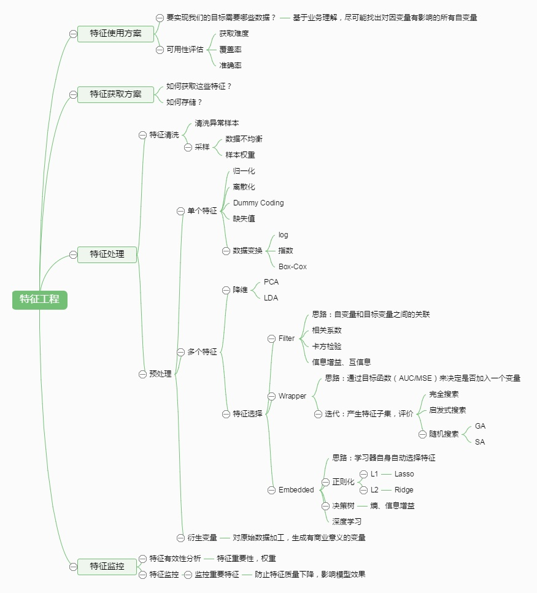

是对[Github](https://github.com/imhuay/Algorithm_Interview_Notes-Chinese)的转载整理，搬运工作，大家也可直接去原文观看。
<!--more-->
目录
---
- [机器学习](#机器学习)
    - [一机器学习基础](#一机器学习基础)
    - [二机器学习实践](#二机器学习实践)
    - [三机器学习算法](#三机器学习算法)


# 机器学习


## 一机器学习基础

Index
---


- [1偏差与方差](#1偏差与方差)
    - [1.1导致偏差和方差的原因](#导致偏差和方差的原因)
    - [1.2深度学习中的偏差与方差](#深度学习中的偏差与方差)
    - [1.3偏差/方差 与 Boosting/Bagging](#偏差方差与boostingbagging)
    - [1.4偏差与方差的计算公式](#偏差与方差的计算公式)
    - [1.5偏差与方差的权衡（过拟合与模型复杂度的权衡）](#偏差与方差的权衡过拟合与模型复杂度的权衡)
- [2生成模型与判别模型](#2生成模型与判别模型)
- [3先验概率与后验概率](#3先验概率与后验概率)


### 1偏差与方差

- **偏差**与**方差**分别是用于衡量一个模型**泛化误差**的两个方面(都是**期望值**和某值比)；
  - 模型的**偏差**，指的是模型预测的**期望值**与**真实值**之间的差；（欠拟合）
  - 模型的**方差**，指的是模型预测的**期望值**与**预测值**之间的差平方和；（过拟合）
- 在**监督学习**中，模型的**泛化误差**可**分解**为偏差、方差与噪声之和。
<div style="width: 300px; margin: auto"></div>

- **偏差**用于描述模型的**拟合能力**；<br/>
- **方差**用于描述模型的**稳定性**。
<div style="width: 200px; margin: auto"></div>

#### 导致偏差和方差的原因
- **偏差**通常是由于我们对学习算法做了**错误的假设**，或者模型的**复杂度不够**；（类似于拟合错了，或者欠拟合？）
  - 比如真实模型是一个二次函数，而我们假设模型为一次函数，这就会导致偏差的增大（欠拟合）；
  - **由偏差引起的误差**通常在**训练误差**上就能体现，或者说训练误差主要是由偏差造成的
- **方差**通常是由于**模型的复杂度相对于训练集过高**导致的；(类似于过拟合？？)
  - 比如真实模型是一个简单的二次函数，而我们假设模型是一个高次函数，这就会导致方差的增大（过拟合）；
  - **由方差引起的误差**通常体现在测试误差相对训练误差的**增量**上。

#### 深度学习中的偏差与方差
- 神经网络的拟合能力非常强，因此它的**训练误差**（**偏差**）通常较小；
- 但是过强的拟合能力会导致较大的**方差**，使模型的测试误差（**泛化误差**）增大；
- 因此深度学习的核心工作之一就是研究如何**降低模型的泛化误差**，这类方法统称为**正则化方法**。

#### 偏差/方差与Boosting/Bagging
> 后续整理

#### 偏差与方差的计算公式
- 期望预测是训练集上的？
<div style="width: 400px; margin: auto"></div>

  > **偏差**度量了学习算法的期望预测与真实结果的偏离程度，即刻画了学习算法本身的拟合能力；

- **方差**（Variance）
<div style="width: 200px; margin: auto"></div>

  > **方差**度量了同样大小的**训练集的变动**所导致的学习性能的变化，即刻画了数据扰动所造成的影响（模型的**稳定性**）；
- **噪声？？公式对吗**
<div style="width: 200px; margin: auto"></div>
- **噪声**则表达了在当前任务上任何学习算法所能达到的期望泛化误差的下界，即刻画了**学习问题本身的难度**。
- “**偏差-方差分解**”表明模型的泛化能力是由算法的能力、数据的充分性、任务本身的难度共同决定的。

#### 偏差与方差的权衡（过拟合与模型复杂度的权衡）
- 给定学习任务，
  - 当训练不足时，模型的**拟合能力不够**（数据的扰动不足以使模型产生显著的变化），此时**偏差**主导模型的泛化误差；
  - 随着训练的进行，模型的**拟合能力增强**（模型能够学习数据发生的扰动），此时**方差**逐渐主导模型的泛化误差；
  - 当训练充足后，模型的**拟合能力过强**（数据的轻微扰动都会导致模型产生显著的变化），此时即发生**过拟合**（训练数据自身的、非全局的特征也被模型学习了）

- 偏差和方差的关系和**模型容量**（模型复杂度）、**欠拟合**和**过拟合**的概念紧密相联
<div style="width: 400px; margin: auto"></div>

  - 当模型的容量增大（x 轴）时， 偏差（用点表示）随之减小，而方差（虚线）随之增大
  - 沿着 x 轴存在**最佳容量**，**小于最佳容量会呈现欠拟合**，**大于最佳容量会导致过拟合**。

**Reference**
- [Understanding the Bias-Variance Tradeoff](http://scott.fortmann-roe.com/docs/BiasVariance.html)
- [机器学习中的Bias(偏差)，Error(误差)，和Variance(方差)有什么区别和联系？](https://www.zhihu.com/question/27068705) - 知乎 


### 2生成模型与判别模型
- 监督学习的任务是学习一个模型，对给定的输入预测相应的输出
- 这个模型的一般形式为一个**决策函数**或一个**条件概率分布**（后验概率）：
<div style="width: 200px; margin: auto"></div>

  - **决策函数**：输入 X 返回 Y；其中 Y 与一个**阈值**比较，然后根据比较结果判定 X 的类别
  - **条件概率分布**：输入 X 返回 **X 属于每个类别的概率**；将其中概率最大的作为 X 所属的类别
- 监督学习模型可分为**生成模型**与**判别模型**
  - **判别模型**直接学习决策函数或者条件概率分布
    - 直观来说，**判别模型**学习的是类别之间的最优分隔面，反映的是不同类数据之间的差异
  - **生成模型**学习的是联合概率分布`P(X,Y)`，然后根据条件概率公式计算 `P(Y|X)`
<div style="width: 200px; margin: auto"></div>

**两者之间的联系**
- 由生成模型可以得到判别模型，但由判别模型得不到生成模型。
- 当存在“**隐变量**”时，只能使用**生成模型**
  > 隐变量：当我们找不到引起某一现象的原因时，就把这个在起作用，但无法确定的因素，叫“隐变量”

**优缺点**
- **判别模型**
  - 优点
    - 直接面对预测，往往学习的准确率更高
    - 由于直接学习 `P(Y|X)` 或 `f(X)`，可以对数据进行各种程度的抽象，定义特征并使用特征，以简化学习过程
  - 缺点
    - 不能反映训练数据本身的特性
    - ...
- **生成模型**
  - 优点
    - 可以还原出联合概率分布 `P(X,Y)`，判别方法不能
    - 学习收敛速度更快——即当样本容量增加时，学到的模型可以更快地收敛到真实模型
    - 当存在“隐变量”时，只能使用生成模型
  - 缺点
    - 学习和计算过程比较复杂

**常见模型**
- 判别模型
  - K 近邻、感知机（神经网络）、决策树、逻辑斯蒂回归、**最大熵模型**、SVM、提升方法、**条件随机场**
- 生成模型
  - 朴素贝叶斯、隐马尔可夫模型、混合高斯模型、贝叶斯网络、马尔可夫随机场

**Reference**
- [机器学习---生成模型与判别模型](https://blog.csdn.net/u012101561/article/details/52814571) - CSDN博客 


### 3先验概率与后验概率
> [先验概率，后验概率，似然概率，条件概率，贝叶斯，最大似然](https://blog.csdn.net/suranxu007/article/details/50326873) - CSDN博客 

**条件概率**（似然概率）
- 一个事件发生后另一个事件发生的概率。
- 一般的形式为 `P(X|Y)`，表示 y 发生的条件下 x 发生的概率。
- 有时为了区分一般意义上的**条件概率**，也称**似然概率**

**先验概率**
- 事件发生前的预判概率
- 可以是基于历史数据的统计，可以由背景常识得出，也可以是人的主观观点给出。
- 一般都是**单独事件**发生的概率，如 `P(A)`、`P(B)`。

**后验概率**
- 基于先验概率求得的**反向条件概率**，形式上与条件概率相同（若 `P(X|Y)` 为正向，则 `P(Y|X)` 为反向）

**贝叶斯公式**
<div style="width: 200px; margin: auto"></div>

## 二机器学习实践

Reference
---
- [CS229 课程讲义（中文）](https://github.com/Kivy-CN/Stanford-CS-229-CN) - Kivy-CN - GitHub

Index
---
- [1超参数选择](#1超参数选择)
    - [Grid Search](#grid-search)
    - [Random Search](#random-search)
    - [相关库（未使用）](#相关库未使用)
- [2几种参数估计的区别于联系: MLE、MAP、贝叶斯 TODO](#2几种参数估计的区别于联系-mlemap贝叶斯-todo)
- [3余弦相似度（Cos距离）与欧氏距离的区别和联系](#3余弦相似度cos距离与欧氏距离的区别和联系)
- [4监督学习和无监督学习](#4监督学习和无监督学习)
- [5熵，求投掷均匀正六面体骰子的熵](#5熵)
- [6混淆矩阵、模型度量指标：准确率、精确率、召回率、F1 值等](#6混淆矩阵模型度量指标准确率精确率召回率f1-值等)
- [7如何处理数据中的缺失值](#7如何处理数据中的缺失值)
- [8介绍一个完整的机器学习项目流程](#8介绍一个完整的机器学习项目流程)
- [9数据清洗与特征处理](#9数据清洗与特征处理)
- [10关联规则挖掘的 3 个度量指标：支持度、置信度、提升度](#10关联规则挖掘的-3-个度量指标支持度置信度提升度)

<!-- /TOC -->

### 1超参数选择

####  Grid Search
- 网格搜索
- 在高维空间中对一定区域进行遍历

#### Random Search
- 在高维空间中随机选择若干超参数

#### 相关库（未使用）
- [Hyperopt](http://hyperopt.github.io/hyperopt/)
  - 用于超参数优化的 Python 库，其内部使用 Parzen 估计器的树来预测哪组超参数可能会得到好的结果。
  - GitHub - https://github.com/hyperopt/hyperopt
- [Hyperas](http://maxpumperla.com/hyperas/)
  - 将 Hyperopt 与 Keras 模型集成在一起的库
  - GitHub - https://github.com/maxpumperla/hyperas

## 2几种参数估计的区别于联系: MLE、MAP、贝叶斯 TODO

## 3余弦相似度（Cos距离）与欧氏距离的区别和联系
> geekcircle/machine-learning-interview-qa/[4.md](https://github.com/geekcircle/machine-learning-interview-qa/blob/master/questions/4.md)

- 欧式距离和余弦相似度都能度量 2 个向量之间的相似度
- 放到向量空间中看，欧式距离衡量两点之间的**直线距离**，而余弦相似度计算的是两个向量之间的**夹角**
- **没有归一化时**，欧式距离的范围是 [0, +∞]，而余弦相似度的范围是 [-1, 1]；余弦距离是计算**相似程度**，而欧氏距离计算的是**相同程度**（对应值的相同程度）
- **归一化的情况下**，可以将空间想象成一个超球面（三维），欧氏距离就是球面上两点的直线距离，而向量余弦值等价于两点的球面距离，本质是一样。
- 归一化的话，二者是几乎等价的，具体可参见知乎链接，重点就是要记得这是归一化的条件。欧氏距离越小等价于余弦相似度越大。
- 其实可以将求余弦相似转换为求欧氏距离。因为计算余弦相似的复杂度高。

> [欧氏距离和余弦相似度的区别是什么？](https://www.zhihu.com/question/19640394) - 知乎 

## 4监督学习和无监督学习
> geekcircle/machine-learning-interview-qa/[6.md](https://github.com/geekcircle/machine-learning-interview-qa/blob/master/questions/6.md)

- 监督学习：比如分类回归
- 无监督学习 :比如聚类（如新闻分类，比如根据样本间的相似性，类内小，类间大）。
- 半监督学习，半监督学习，其训练数据的一部分是有标签的，另一部分没有标签，而没标签数据的数量常常极大于有标签数据数量（这也是符合现实情况的）。隐藏在半监督学习下的基本规律在于：数据的分布必然不是完全随机的，通过一些有标签数据的局部特征，以及更多没标签数据的整体分布，就可以得到可以接受甚至是非常好的分类结果。（此处大量忽略细节）


## 5熵
> geekcircle/machine-learning-interview-qa/[7.md](https://github.com/geekcircle/machine-learning-interview-qa/blob/master/questions/7.md)

**什么是熵，信息量、信息熵、KL 散度（相对熵）与交叉熵**
- 熵是为消除不确定性所需要获得的信息量，可见[链接](https://blog.csdn.net/haolexiao/article/details/70142571)，熵越大，不确定性越高。
- 信息量：用信息所需的编码长度定义，编码长度与出现概率负相关，一个词出现的频繁，编码长度短，代价高。比如a是0，其他的就不能用0开始了。
<div style="width: 200px; margin: auto"></div>
- 信息熵：是信息量的均值/编码的平均长度，代表一个**分布**的信息量：
<div style="width: 300px; margin: auto"></div>
- 交叉熵：用猜测的分布编码方式p(x) 去 编码真实的q(x)分布,得到的平均编码长度或者信息量。用交叉熵其实可以比较好的衡量预测的分布和真是分布的差异（两个编码方式的差异），越接近值越小：
- 交叉熵和KL散度（相对熵）
<div style="width: 600px; margin: auto"></div>


**求投掷均匀正六面体骰子的熵**

- 问题描述：向空中投掷硬币，落地后有两种可能的状态，一个是正面朝上，另一个是反面朝上，每个状态出现的概率为1/2。如投掷均匀的正六面体的骰子，则可能会出现的状态有6个，每一个状态出现的概率均为1/6。试通过计算来比较硬币状态的不确定性与骰子状态的不确定性的大小。
<div style="width: 600px; margin: auto"></div>

    

## 6混淆矩阵、模型度量指标：准确率、精确率、召回率、F1 值等

**混淆矩阵**

- True Positive(TP)：将正类预测为正类的数量.
- True Negative(FN)：将负类预测为负类的数量.
- False Positive(TN)：将负类预测为正类数 → 误报 (Type I error). （错杀好人）
- False Negative(FP)：将正类预测为负类数 → 漏报 (Type II error). (放走坏人，再看看对不对)

<div style="width: 500px; margin: auto"></div>

**准确率**（accuracy） 真的真的占总的。
<div style="width: 300px; margin: auto"></div>

精确率和召回率的分子都是TP
**精确率**（precision）TP占预测为真的。
<div style="width: 200px; margin: auto"></div>

> 准确率与精确率的区别：
>> 在正负样本不平衡的情况下，**准确率**这个评价指标有很大的缺陷。若正样本很多那种。全部预测为正样本，acc很高，没啥意义。
    
**召回率**（recall, sensitivity, true positive rate）TP占预测对的
<div style="width: 200px; margin: auto"></div>

**F1值**——精确率和召回率的调和均值
<div style="width: 200px; margin: auto"></div>

> 只有当精确率和召回率都很高时，F1值才会高


## 7如何处理数据中的缺失值
> geekcircle/machine-learning-interview-qa/[1.md](https://github.com/geekcircle/machine-learning-interview-qa/blob/master/questions/1.md)

可以分为以下 2 种情况：

**1缺失值较多**

直接舍弃该列特征，否则可能会带来较大的噪声，从而对结果造成不良影响。

**2缺失值较少**
当缺失值较少（<10%）时，可以考虑对缺失值进行填充，以下是几种常用的填充策略：

- 用一个**异常值**填充（比如 0），将缺失值作为一个特征处理
   ` data.fillna(0) `  
- 用**均值**|**条件均值**填充
 > 如果数据是不平衡的，那么应该使用条件均值填充
  > 所谓**条件均值**，指的是与**缺失值所属标签相同的**所有数据的均值
        `data.fillna(data.mean())`  
- 用相邻数据填充
        ```
        # 用前一个数据填充
        data.fillna(method='pad')
        # 用后一个数据填充
        data.fillna(method='bfill') 
        ```      
- 插值
        `data.interpolate()` 
- 拟合
  > 简单来说，就是将缺失值也作为一个预测问题来处理：将数据分为正常数据和缺失数据，对有值的数据采用随机森林等方法拟合，然后对有缺失值的数据进行预测，用预测的值来填充。


## 8介绍一个完整的机器学习项目流程
> geekcircle/machine-learning-interview-qa/[2.md](https://github.com/geekcircle/machine-learning-interview-qa/blob/master/questions/2.md)

1. 数学抽象

    明确问题是进行机器学习的第一步。机器学习的训练过程通常都是一件非常耗时的事情，胡乱尝试时间成本是非常高的。

    这里的抽象成数学问题，指的是根据数据明确任务目标，是分类、还是回归，或者是聚类。

1. 数据获取

    数据决定了机器学习结果的上限，而算法只是尽可能逼近这个上限。

    数据要有代表性，否则必然会过拟合。

    对于分类问题，数据偏斜不能过于严重（平衡），不同类别的数据数量不要有数个数量级的差距。

    对数据的量级要有一个评估，多少个样本，多少个特征，据此估算出内存需求。如果放不下就得考虑改进算法或者使用一些降维技巧，或者采用分布式计算。

1. 预处理与特征选择

    良好的数据要能够提取出良好的特征才能真正发挥效力。

    预处理/数据清洗是很关键的步骤，往往能够使得算法的效果和性能得到显著提高。归一化、离散化、因子化、缺失值处理、去除共线性等，数据挖掘过程中很多时间就花在它们上面。这些工作简单可复制，收益稳定可预期，是机器学习的基础必备步骤。

    筛选出显著特征、摒弃非显著特征，需要机器学习工程师反复理解业务。这对很多结果有决定性的影响。特征选择好了，非常简单的算法也能得出良好、稳定的结果。这需要运用特征有效性分析的相关技术，如**相关系数、卡方检验、平均互信息、条件熵、后验概率、逻辑回归权重等方法**。

1. 模型训练与调优

    直到这一步才用到我们上面说的算法进行训练。
    
    现在很多算法都能够封装成黑盒使用。但是真正考验水平的是调整这些算法的（超）参数，使得结果变得更加优良。这需要我们对算法的原理有深入的理解。理解越深入，就越能发现问题的症结，提出良好的调优方案。

1. 模型诊断

    如何确定模型调优的方向与思路呢？这就需要对模型进行诊断的技术。

    过拟合、欠拟合 判断是模型诊断中至关重要的一步。常见的方法如**交叉验证，绘制学习曲线**等。过拟合的基本调优思路是增加数据量，降低模型复杂度。欠拟合的基本调优思路是提高特征数量和质量，增加模型复杂度。

    **误差分析**也是机器学习至关重要的步骤。通过观察误差样本，全面分析误差产生误差的原因:是参数的问题还是算法选择的问题，是特征的问题还是数据本身的问题......

    诊断后的模型需要进行调优，调优后的新模型需要重新进行诊断，这是一个**反复迭代**不断逼近的过程，需要不断地尝试， 进而达到最优状态。

1. 模型融合/集成

    一般来说，模型融合后都能使得效果有一定提升。而且效果很好。

    工程上，主要提升算法准确度的方法是分别在模型的前端（特征清洗和预处理，不同的采样模式）与后端（模型融合）上下功夫。因为他们比较标准可复制，效果比较稳定。而直接调参的工作不会很多，毕竟大量数据训练起来太慢了，而且效果难以保证。

1. 上线运行

    这一部分内容主要跟工程实现的相关性更大。工程上是结果导向，模型在线上运行的效果直接决定模型的成败。不单纯包括其准确程度、误差等情况，还包括其运行的速度(时间复杂度)、资源消耗程度（空间复杂度）、稳定性是否可接受。

    这些工作流程主要是工程实践上总结出的一些经验。并不是每个项目都包含完整的一个流程。这里的部分只是一个指导性的说明，只有多实践，多积累项目经验，才会有自己更深刻的认识。


## 9数据清洗与特征处理
> geekcircle/machine-learning-interview-qa/[8.md](https://github.com/geekcircle/machine-learning-interview-qa/blob/master/questions/8.md)

<!-- <div align="center"></div> -->

> [机器学习中的数据清洗与特征处理综述](https://tech.meituan.com/machinelearning-data-feature-process.html) - 美团点评技术

## 10关联规则挖掘的 3 个度量指标：支持度、置信度、提升度（频繁项集？）

- 关联规则挖掘可以在大数据库中发现感兴趣的规则。目的是利用一些度量指标来发现数据库中存在的强规则。是知识发现，不是预测，是一种无监督的方法。（如啤酒与尿布的购物车分析、网页浏览偏好）
- 所有规则中发现该兴趣的规则：利用一些度量方法来筛选，比如最小支持度、最小置信度。
- 可参考：https://www.jianshu.com/p/7d459ace31ab
- 下面的写的有点看不懂，看看上面简书的链接吧。

**支持度**（Support）
- 可以利用最小支持度从数据库中找到频繁项集。
- X → Y 的支持度表示项集 {X,Y} 在总项集中出现的概率

<div style="width: 300px; margin: auto"></div>

- 其中，I 表示总事务集，`num()`表示事务集中特定项集出现的次数，`P(X)=num(X)/num(I)`

**置信度**（Confidence
- 可以利用最小置信度从频繁项集中找到关联规则。
- X → Y 的置信度表示在先决条件 X 发生的情况下，由规则 X → Y 推出 Y 的概率。

<div style="width: 300px; margin: auto"></div>

**提升度**（Lift）可以看看规则是否无效
- X → Y 的提升度表示含有X的条件下，同时含有Y的概率，与Y总体发生的概率之比。

<div style="width: 300px; margin: auto"></div>

规则的有效性：
---
- 满足最小支持度和最小置信度的规则，叫做“强关联规则”
    > 最小支持度和最小置信度是人工设置的阈值
- `Lift(X→Y) > 1` 的 X→Y 正相关。
- `Lift(X→Y) <1` 的 X→Y 是负相关的关系，一个出现可能导致另一个不出现。
- 特别地，`Lift(X→Y) = 1` 时，X 与 Y 相互独立。
- 一般认为，提升度大于3挖掘出的关联规则才是有价值的。可以评估一个出现**提升**另一个出现的程度。

**判断规则的有效性**
---
问题：已知有1000名顾客买年货，分为甲乙两组，每组各500人，其中甲组有500人买了茶叶，同时又有450人买了咖啡；乙组有450人买了咖啡，如表所示，请问“茶叶→咖啡”是一条有效的关联规则吗？

组次 | 买茶叶的人数 | 买咖啡的人数
--- | ---------- | ---------
 甲组（500人） | 500 | 450
 乙组（500人） | 0 | 450

 答：
 - “茶叶→咖啡”的支持度：Support(X→Y) = 450 / 1000 = 45%（两个都买了的人占总人数）
 - “茶叶→咖啡”的置信度：Confidence(X→Y) = 450 / 500 = 90%（都买的除以茶叶的）
 - “茶叶→咖啡”的提升度：Lift(X→Y) = 90% / 90% = 1
 （都买的除茶叶的除咖啡的；或者置信度/咖啡）
 由于提升度 `Lift(X→Y) = 1`，表示 X 与 Y 相互独立。也就是说，是否购买咖啡，与是否购买茶叶无关联。规则“茶叶→咖啡”不成立，或者说几乎没有关联，虽然它的置信度高达90%，但它不是一条有效的关联规则。

## 三机器学习算法
**RoadMap**
---
- [逻辑斯蒂回归](#逻辑斯蒂回归)
- [支持向量机](#支持向量机)
- [决策树](#决策树)
- [AdaBoost 算法](#adaboost-算法)
  - [梯度提升决策树 GBDT](#梯度提升决策树-gbdt)
- [机器学习实践](#机器学习实践)


**Index**
---
<!-- TOC -->

- [符号说明](#符号说明)
- [信息论](#信息论)
- [逻辑斯蒂回归](#逻辑斯蒂回归)
    - [逻辑斯蒂回归模型定义](#逻辑斯蒂回归模型定义)
    - [逻辑斯蒂回归推导](#逻辑斯蒂回归推导)
    - [多分类逻辑斯蒂回归模型 TODO](#多分类逻辑斯蒂回归模型-todo)
- [支持向量机](#支持向量机)
    - [支持向量机简述](#支持向量机简述)
        - [什么是支持向量](#什么是支持向量)
        - [支持向量机的分类](#支持向量机的分类)
        - [核函数与核技巧](#核函数与核技巧)
        - [最大间隔超平面背后的原理](#最大间隔超平面背后的原理)
    - [支持向量机推导](#支持向量机推导)
        - [线性可分支持向量机推导](#线性可分支持向量机推导)
- [决策树](#决策树)
    - [信息增益与信息增益比 TODO](#信息增益与信息增益比-todo)
    - [分类树 - ID3 决策树与 C4.5 决策树 TODO](#分类树---id3-决策树与-c45-决策树-todo)
    - [决策树如何避免过拟合 TODO](#决策树如何避免过拟合-todo)
    - [回归树 - CART 决策树](#回归树---cart-决策树)
        - [CART 回归树算法推导](#cart-回归树算法推导)
        - [示例: 选择切分变量与切分点](#示例-选择切分变量与切分点)
- [集成学习](#集成学习)
    - [集成学习的基本策略(3)](#集成学习的基本策略3)
        - [1. Boosting](#1-boosting)
            - [Boosting 策略要解决的两个基本问题](#boosting-策略要解决的两个基本问题)
        - [2. Bagging](#2-bagging)
        - [3. Stacking](#3-stacking)
    - [AdaBoost 算法](#adaboost-算法)
        - [AdaBoost 算法描述](#adaboost-算法描述)
        - [AdaBoost 算法要点说明](#adaboost-算法要点说明)
    - [前向分步算法](#前向分步算法)
        - [加法模型](#加法模型)
        - [前向分步算法描述](#前向分步算法描述)
        - [前向分步算法与 AdaBoost](#前向分步算法与-adaboost)
- [梯度提升决策树 GBDT](#梯度提升决策树-gbdt)
    - [提升树 Boosting Tree](#提升树-boosting-tree)
        - [提升树算法描述](#提升树算法描述)
    - [梯度提升(GB)算法](#梯度提升gb算法)
    - [GBDT 算法描述](#gbdt-算法描述)
    - [XGBoost 算法](#xgboost-算法)
        - [XGBoost 与 GB 的主要区别](#xgboost-与-gb-的主要区别)
        - [XGBoost 的一些内部优化](#xgboost-的一些内部优化)
- [随机森林](#随机森林)
- [机器学习实践](#机器学习实践)
    - [Box–Muller 变换](#boxmuller-变换)
- [降维](#降维)
    - [SVD](#svd)
    - [PCA](#pca)
    - [t-SNE](#t-sne)
    - [Reference](#reference)

<!-- /TOC -->

<!-- # 什么是推导
- 给出一个问题或模型的定义，然后求其最优解的过程 -->
## 符号说明
- 基本遵从《统计学习方法》一书中的符号表示。
- 除特别说明，默认`w`为行向量，`x`为列向量，以避免在`wx`中使用转置符号；但有些公式为了更清晰区分向量与标量，依然会使用`^T`的上标，注意区分。

    输入实例`x`的特征向量记为：

   <div style="width: 300px; margin: auto"></div>

    注意：`x_i` 和 `x^(i)` 含义不同，前者表示训练集中第 i 个实例，后者表示特征向量中的第 i 个分量；因此，通常记训练集为：

<div style="width: 300px; margin: auto"></div>

    > 特征向量用小`n`表示维数，训练集用大`N`表示个数

## 信息论
> 《深度学习》 3.13 信息论

- 信息论的基本想法是：一件**不太可能的事发生**，要比一件非常可能的事发生，提供**更多的信息**。
- 该想法可描述为以下性质：
    1. 非常可能发生的事件信息量要比较少，并且极端情况下，**一定能够发生的事件应该没有信息量**。
    2. 比较不可能发生的事件具有更大的信息量。
    3. **独立事件应具有增量的信息**。例如，投掷的硬币两次正面朝上传递的信息量，应该是投掷一次硬币正面朝上的信息量的两倍。

### 信息熵 与 自信息

- **自信息**（self-information）是一种量化以上性质的函数，定义一个事件`x`的自信息为：
$$I(x)=-\log P(x)$$

 > 当该对数的底数为自然对数 e 时，单位为奈特（nats）；当以 2 为底数时，单位为比特（bit）或香农（shannons）

- 自信息只处理单个的输出。
- **信息熵**（Information-entropy）用于对整个概率分布中的**不确定性总量**进行量化：
$$H(X)=E_{X \sim P}[I(x)]=-\sum_{x \in X}P(x)\log P(x)$$

    > 信息论中，记 `0log0 = 0`

### 交叉熵 与 相对熵/KL散度

- 定义 **P 对 Q** 的 **KL 散度**（Kullback-Leibler divergence）：
$$D_P(Q)=E_{X\sim P}\left [ \log \frac{P(x)}{Q(x)} \right ]=\sum_{x \in X}P(x)\left [ \log P(x)-\log Q(x) \right ]$$

**KL 散度在信息论中度量的是哪个直观量？**
- 在离散型变量的情况下， KL 散度衡量的是：当我们使用一种被设计成能够使得概率分布 Q 产生的消息的长度最小的编码，发送包含由概率分布 P 产生的符号的消息时，所需要的额外信息量。
- KL散度是两个概率分布P和Q差别的非对称性的度量。 KL散度是用来 度量使用基于Q的编码来编码来自P的样本平均所需的额外的位元数。 典型情况下，P表示数据的真实分布，Q表示数据的理论分布，模型分布，或P的近似分布。

**KL散度的性质**：
- 非负；KL 散度为 0 当且仅当P 和 Q 在离散型变量的情况下是相同的分布，或者在连续型变量的情况下是“几乎处处”相同的
- 
- 不对称；D_p(q) != D_q(p)

**交叉熵**（cross-entropy）：
$$H_P(Q)=-E_{X\sim P}\log Q(x)=-\sum_{x \in X}P(x)\log Q(x)$$

> [信息量，信息熵，交叉熵，KL散度和互信息（信息增益）](https://blog.csdn.net/haolexiao/article/details/70142571) - CSDN博客

**交叉熵 与 KL 散度的关系**
- **针对 Q 最小化交叉熵等价于最小化 P 对 Q 的 KL 散度**，因为 Q 并不参与被省略的那一项。
$$H_P(Q)=H(P)+D_P(Q)$$
- P对Q的交叉熵=P的信息熵+P对Q的相对熵
- 其中P是真实的Q是预测的

- 最大似然估计中，最小化 KL 散度其实就是在最小化分布之间的交叉熵。
    > 《深度学习》 ch5.5 - 最大似然估计


## 逻辑斯蒂回归

### 定义及推导

- 可参考https://blog.csdn.net/ligang_csdn/article/details/53838743
- 我写的真的像狗屎一样乱.....
<div style="width: 600px; margin: auto"></div>

### 多分类的逻辑斯蒂回归（TODO）

## 支持向量机

### 支持向量机简述
- 支持向量机（Support Vector Machines, SVM）是一种二分类模型。它的**基本模型**是定义在特征空间上的**间隔最大**的线性分类器，间隔最大使它有别于感知机；支持向量机还包括**核技巧**，这使其成为实质上的非线性分类器。
- **SVM 的学习策略就是间隔最大化**，可形式化为一个求解**凸二次规划**的问题，也等价于正则化的**合页损失函数**的最小化问题。
- SVM 的最优化算法是求解凸二次规划的最优化算法。

#### 什么是支持向量
- 训练数据集中与分离超平面距离最近的样本点的实例称为支持向量
- 更通俗的解释：
  - 数据集种的某些点，位置比较特殊。比如 `x+y-2=0` 这条直线，假设出现在直线上方的样本记为 A 类，下方的记为 B 类。
  - 在寻找找这条直线的时候，一般只需看两类数据，它们各自最靠近划分直线的那些点，而其他的点起不了决定作用。
  - 这些点就是所谓的“支持点”，在数学中，这些点称为**向量**，所以更正式的名称为“**支持向量**”。
  > [SVM中支持向量的通俗解释](https://blog.csdn.net/AerisIceBear/article/details/79588583) - CSDN博客 

#### 支持向量机的分类
- 线性可分支持向量机
  - 当训练数据**线性可分**时，通过**硬间隔最大化**，学习一个线性分类器，即线性可分支持向量机，又称**硬间隔支持向量机**。
- 线性支持向量机
  - 当训练数据**接近线性可分**时，通过**软间隔最大化**，学习一个线性分类器，即线性支持向量机，又称**软间隔支持向量机**。
- 非线性支持向量机
  - 当训练数据**线性不可分**时，通过使用**核技巧**及软间隔最大化，学习非线性支持向量机。

#### 核函数与核技巧
- **核函数**表示将输入从输入空间映射到特征空间后得到的特征向量之间的内积

#### 最大间隔超平面背后的原理
> 机器学习技法 (1-5) - 林轩田
- 相当于在**最小化权重**时对训练误差进行了约束——对比 L2 范数正则化，则是在最小化训练误差时，对权重进行约束

<div style="width: 300px; margin: auto"></div>
  > 与 L2 正则化的区别
- 相当于**限制了模型复杂度**——在一定程度上防止过拟合，具有更强的泛化能力

## 支持向量机推导
- SVM 由简至繁包括：**线性可分支持向量机**、**线性支持向量机**以及**非线性支持向量机**
  
### 线性可分支持向量机推导
> 《统计学习方法》 & [支持向量机SVM推导及求解过程](https://blog.csdn.net/american199062/article/details/51322852#commentBox) - CSDN博客
- 当训练数据**线性可分**时，通过**硬间隔最大化**，学习一个线性分类器，即线性可分支持向量机，又称**硬间隔支持向量机**。
- 线性 SVM 的推导分为两部分
  1. 如何根据**间隔最大化**的目标导出 SVM 的**标准问题**；
  1. 拉格朗日乘子法对偶问题的求解过程.

